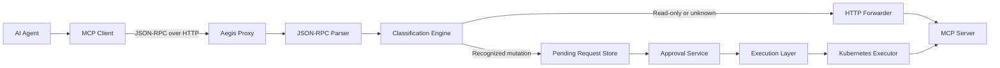

# Aegis

## Adaptive Host Immunity

**A transparent, approval-gated execution proxy for MCP infrastructure tools.**

> **Project status:** functional prototype. Aegis implements request forwarding,
> inspection, classification, suspension, and manual release, but it is not yet
> production-ready or a complete security boundary.

## Project Overview

AI agents can use the Model Context Protocol (MCP) to invoke infrastructure
tools. Direct execution is risky because an incorrect, ambiguous, or compromised
agent can turn a generated tool call into a high-impact change without an
independent checkpoint.

Aegis sits between an MCP client and an MCP server. It forwards known read-only
and unclassified requests while suspending recognized mutating Kubernetes tool
calls. Suspended requests receive a stable SHA-256 fingerprint and an expiring
nonce, then require a separate approval request before Aegis releases the exact
stored bytes to the upstream server.

Human review is the intended control for high-impact actions: an operator should
be able to inspect what will run before allowing it to reach infrastructure.
Transparent, byte-preserving forwarding also matters because a security gateway
should not silently rewrite agent intent or upstream responses.

The current `/approve/` endpoint is a prototype release mechanism. It does not
authenticate an operator or verify a signed approval, so it must not be treated
as production-grade human authorization.

## Vision

Aegis is intended to become a secure execution gateway between AI agents and
high-impact infrastructure. The long-term system will combine explicit approval,
policy evaluation, authenticated identities, durable audit evidence, and
isolated execution backends while preserving a clear record of what an agent
requested and what was ultimately executed.

The current repository establishes the request-interception and execution
boundaries needed for that direction. Production controls are listed separately
under [Planned Features](#planned-features).

## Architecture



| Component | Current responsibility |
| --- | --- |
| AI Agent / MCP Client | External caller that sends MCP JSON-RPC requests to Aegis. |
| Aegis Proxy | FastAPI entry point that captures raw request bytes and coordinates classification, forwarding, or suspension. |
| JSON-RPC Parser | Extracts the JSON-RPC version, request ID, method, and `params.name` tool identifier without changing the body. |
| Classification Engine | Compares tool names with explicit read-only and mutating Kubernetes tool sets. |
| Pending Request Store | Holds suspended requests, headers, fingerprints, metadata, and expiry times in process memory. |
| Approval Service | Accepts a nonce through `POST /approve/` and requests execution of the stored payload. |
| Execution Layer | Defines the backend interface, result model, factory, and error types. |
| Kubernetes Executor | Sends stored raw bytes to the configured Kubernetes MCP server over HTTP. This is a transport implementation, not a Kubernetes workload controller. |
| MCP Server | External upstream service that performs the actual tool operation. |

### Request flow

1. The MCP client sends a request to `POST /`.
2. Aegis reads the raw body once and inspects a decoded copy.
3. Recognized read-only tools are forwarded immediately.
4. Recognized mutating tools are fingerprinted, assigned a UUID4 nonce, stored
   with a TTL, and answered with HTTP `202`.
5. `POST /approve/` with the nonce loads the original request and passes its
   stored bytes and headers to the configured executor.
6. A successful upstream execution removes the pending request. A failed
   execution leaves it pending for another attempt until it expires.

Unparseable requests, requests without a recognized tool name, and unknown tools
currently follow the forwarding path. A default-deny policy is planned.

## Current Implementation Status

### Implemented

- [x] FastAPI application with lifecycle, metadata, health, and API documentation
- [x] FastAPI dependency injection for settings, forwarding, storage, logging,
      and execution
- [x] Validated environment-based configuration with Pydantic Settings
- [x] Structured JSON logging with `structlog`
- [x] Transparent HTTP reverse-proxy path using HTTPX
- [x] Raw request and response body forwarding
- [x] JSON-RPC inspection and MCP tool-name extraction
- [x] Explicit read-only and mutating tool classification
- [x] SHA-256 request fingerprinting and UUID4 nonce generation
- [x] Thread-safe, TTL-aware in-memory pending request storage
- [x] Mutating-request suspension with HTTP `202` responses
- [x] Approval endpoint that releases a pending request by nonce
- [x] Execution interface, result model, backend factory, and error model
- [x] Kubernetes MCP HTTP executor
- [x] Unit and integration-style tests for configuration, parsing, forwarding,
      suspension, storage, approval, and execution
- [x] Docker image definition

### Current limitations

- Approval is unauthenticated and is based only on possession of a nonce.
- HMAC verification is not implemented.
- Pending state is process-local and is lost on restart.
- Duplicate sequential approvals are rejected after successful execution, but
  nonce claiming is not atomic across concurrent approval requests.
- Unknown and invalid requests are forwarded rather than denied.
- The tool policy is a static allowlist embedded in source code.
- Retries are configurable but are not implemented by the executor.
- No Kubernetes manifests or production deployment configuration are included.

## Planned Features

The following capabilities are future work and are **not implemented**:

- Redis-backed pending request storage
- Persistent approval and audit database
- HMAC-signed approval artifacts
- Atomic nonce consumption and complete replay protection
- Production authentication and authorization
- Role-based access control (RBAC)
- Configurable policy engine and default-deny behavior
- Multiple execution backends
- Web approval dashboard
- Searchable audit history
- OpenTelemetry tracing
- Prometheus metrics
- Rate limiting
- High-availability deployment
- Kubernetes deployment manifests and production hardening

## Repository Structure

```text
Aegis/
├── app/
│   ├── execution/              # Execution interface, models, factory, and Kubernetes backend
│   ├── routes/                 # Proxy and approval HTTP routes
│   ├── utils/                  # Reserved package for shared utilities
│   ├── config.py               # Validated environment settings
│   ├── crypto.py               # SHA-256 and UUID4 helpers
│   ├── dependencies.py         # FastAPI dependency providers
│   ├── forwarder.py            # Transparent upstream HTTP forwarding
│   ├── logger.py               # Structured logging configuration
│   ├── main.py                 # FastAPI application entry point
│   ├── models.py               # Pending and supporting data models
│   ├── pending_store.py        # In-memory TTL pending store
│   ├── rpc_parser.py           # Active JSON-RPC parser and classifier
│   └── tool_policy.py          # Read-only and mutating tool sets
├── tests/                      # Pytest test suite
├── .env.example                # Example runtime environment
├── Dockerfile                 # Python 3.12 container image
├── pyproject.toml              # Pytest, Ruff, Black, isort, and mypy configuration
└── requirements.txt            # Runtime and development dependencies
```

`app/parser.py` and `app/security.py` are legacy placeholders retained in the
current tree; the active implementations are `app/rpc_parser.py` and
`app/crypto.py`.

## Development Phases

| Phase | Status | Scope |
| --- | --- | --- |
| 1 — Project foundation | Completed | FastAPI shell, settings, dependency wiring, logging, health endpoints, tests, and Dockerfile. |
| 2 — Transparent proxy | Completed | Byte-preserving HTTP forwarding and upstream error mapping. |
| 3 — JSON-RPC inspection | Completed | Safe parsing, tool extraction, and read-only/mutating/unknown classification. |
| 4 — Cryptographic execution guard | Completed | SHA-256 fingerprints, UUID4 nonces, TTL storage, and mutation suspension. |
| 5 — Approval workflow | Prototype completed | Nonce-based approval route, successful-request removal, and duplicate sequential approval rejection. Authentication and signed approvals remain planned. |
| 6 — Execution framework | Completed | Executor abstraction, factory, result model, and Kubernetes MCP HTTP backend. |
| 7 — Durable security controls | Upcoming | Persistent storage, authenticated approvals, HMAC verification, atomic replay protection, and policy enforcement. |
| 8 — Operations and user experience | Upcoming | Audit UI, observability, rate limiting, deployment manifests, and HA operation. |

## Team Responsibilities

No contributor-to-area mapping is recorded in the repository. Until named
ownership is documented, the original work split is represented by role:

| Area | Role-based ownership |
| --- | --- |
| Proxy | HTTP transport, transparent forwarding, header handling, and upstream failure mapping |
| Security | Request classification, fingerprints, nonce design, signed approvals, and replay protection |
| Approval | Pending-request lifecycle, operator review flow, approval API, and future dashboard |
| Execution | Executor contract, backend selection, Kubernetes transport, and execution result handling |
| Infrastructure | Containerization, deployment, persistence services, observability, and CI/CD |

## Technology Stack

| Technology | Use in this repository |
| --- | --- |
| Python 3.12 | Application and test runtime |
| FastAPI | HTTP API and dependency injection |
| Pydantic / Pydantic Settings | Data validation and environment configuration |
| HTTPX | Asynchronous proxy and executor transport |
| structlog | Structured JSON logging |
| Pytest / pytest-asyncio | Automated tests |
| Ruff | Linting and import checks |
| Black | Formatting checks |
| mypy | Static type checking |
| Docker | Reproducible service image |
| Kubernetes MCP server | Configured upstream integration target; no cluster manifests are included |

GitHub Actions is not currently configured.

## Getting Started

### Prerequisites

- Python 3.12
- An HTTP-accessible MCP server for end-to-end forwarding

```bash
git clone https://github.com/mzain2004/aegis.git Aegis
cd Aegis
python -m venv .venv
```

Activate the virtual environment:

```powershell
# Windows PowerShell
.\.venv\Scripts\Activate.ps1
```

```bash
# Linux or macOS
source .venv/bin/activate
```

Install dependencies, create local configuration, and start the service:

```bash
pip install -r requirements.txt
cp .env.example .env
uvicorn app.main:app --reload
```

On PowerShell, use `Copy-Item .env.example .env` instead of `cp` if the `cp`
alias is unavailable.

The local API is available at `http://127.0.0.1:8000` when started with the
command above. `PROXY_PORT` is used by the application configuration and Docker
defaults, but Uvicorn CLI options control the development server bind address.
To use the configured default port explicitly:

```bash
uvicorn app.main:app --reload --host 0.0.0.0 --port 9000
```

### HTTP endpoints

| Endpoint | Purpose |
| --- | --- |
| `GET /` | Service metadata |
| `GET /health` | Basic health response |
| `POST /` | MCP proxy, inspection, and suspension entry point |
| `POST /approve/` | Prototype nonce-based release endpoint |
| `GET /docs` | Swagger UI |
| `GET /redoc` | ReDoc |

### Configuration

| Variable | Default | Current use |
| --- | --- | --- |
| `PROXY_HOST` | `0.0.0.0` | Documented service bind host |
| `PROXY_PORT` | `9000` | Documented service/container port |
| `K8S_MCP_SERVER_URL` | `http://127.0.0.1:8000` | Upstream MCP endpoint |
| `MCP_TIMEOUT_SECONDS` | `10` | Transparent forwarder timeout |
| `PENDING_REQUEST_TTL_SECONDS` | `300` | Pending request lifetime |
| `EXECUTION_BACKEND` | `kubernetes` | Executor selected by the factory |
| `EXECUTION_TIMEOUT` | `10` | Executor HTTP timeout |
| `EXECUTION_RETRIES` | `0` | Validated setting; retries are not yet implemented |
| `LOG_LEVEL` | `INFO` | Structured logging level |
| `ENVIRONMENT` | `development` | Runtime environment label |
| `SHARED_HMAC_SECRET` | Development value | Validated but reserved for future HMAC verification |
| `NONCE_TTL` | `300` | Validated but currently superseded by `PENDING_REQUEST_TTL_SECONDS` |

Do not use the example HMAC secret in a production environment.

## Docker

Create `.env`, build the image, and run the container:

```bash
cp .env.example .env
docker build -t aegis .
docker run --rm --env-file .env -p 9000:9000 aegis
```

The container starts Uvicorn on `0.0.0.0:9000`. When the upstream MCP server
runs on the host, set `K8S_MCP_SERVER_URL` to an address reachable from the
container; `127.0.0.1` inside the container refers to the container itself.

## Testing and Quality Checks

Run these commands from the repository root with the virtual environment active:

```bash
pytest
ruff check .
black --check .
mypy app tests
```

To apply the configured formatter:

```bash
black .
```

The repository currently has no automated CI workflow, so contributors must run
the checks locally.

## Security Design

### Implemented controls

- **Transparent forwarding:** Aegis sends raw request bytes to the upstream MCP
  server and returns raw upstream response bytes. Hop-by-hop response headers
  are excluded from the downstream response.
- **Immutable stored body:** Inspection operates on a decoded copy; suspended
  requests retain the original byte sequence for later execution.
- **SHA-256 fingerprinting:** Each recognized mutating request is hashed before
  storage. The fingerprint is recorded with the pending request; it is not yet
  externally attested or revalidated at approval time.
- **Expiring nonce:** Each pending request receives a UUID4 identifier and is
  removed when its TTL expires.
- **Approval gate:** Recognized mutating tools do not reach the upstream server
  on their initial call. A separate request to `/approve/` is required.
- **Limited replay handling:** After a successful execution, the nonce is
  removed and a later sequential approval receives HTTP `409`.

### Planned controls

- **HMAC approval:** The configuration contains a reserved shared secret, but
  the approval route does not accept or verify an HMAC signature.
- **Complete replay protection:** Atomic nonce claim/consumption is needed to
  prevent concurrent approvals from racing.
- **Authenticated human approval:** Identity verification, RBAC, and an operator
  review interface are not implemented.
- **Policy hardening:** Unknown requests currently pass through. A configurable,
  default-deny policy engine is planned.
- **Durable auditability:** Structured operational logs exist, but there is no
  persistent, tamper-evident approval or execution history.

Current behavior should be evaluated as a prototype mechanism, not as a
production zero-trust guarantee.

## Roadmap

- [x] Project foundation
- [x] Transparent reverse proxy
- [x] JSON-RPC parser and tool classification
- [x] SHA-256 fingerprint and nonce guard
- [x] In-memory pending request workflow
- [x] Prototype approval endpoint
- [x] Execution framework and Kubernetes MCP transport
- [ ] Persistent pending and approval storage
- [ ] HMAC-signed, authenticated approvals
- [ ] Atomic replay protection
- [ ] Configurable policy engine and RBAC
- [ ] Audit history and web dashboard
- [ ] OpenTelemetry and Prometheus observability
- [ ] Rate limiting and production authentication
- [ ] Kubernetes manifests and high-availability deployment

## Contributing

1. Create a focused feature branch from `main`.
2. Keep implementation and documentation changes scoped to one concern.
3. Add or update tests for behavior changes.
4. Run Pytest, Ruff, Black, and mypy before submitting.
5. Follow the configured formatting and typing standards in `pyproject.toml`.
6. Open a pull request that explains the change, its security impact, and how it
   was tested.

Security-sensitive changes should include explicit failure behavior and tests
for malformed, unauthorized, expired, and repeated requests where applicable.

## License

License to be determined.
