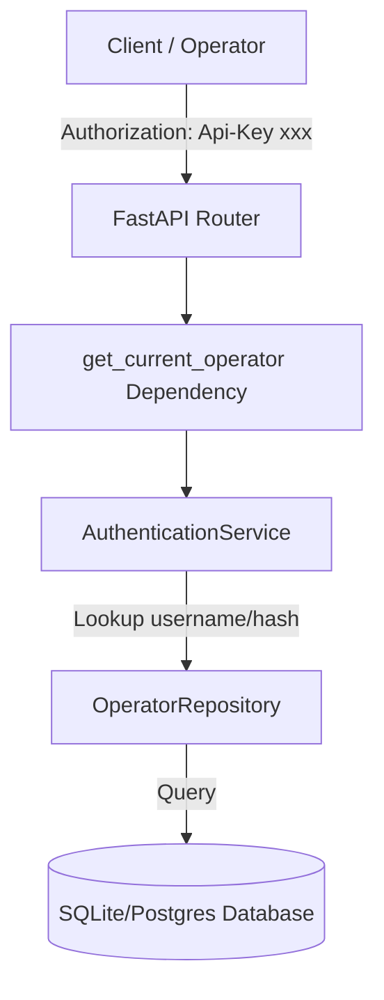

# Veto Ops Authentication Architecture

Veto Ops implements a robust, secure, and modular authentication system designed to trace every administrative action and infrastructure mutation back to a verified human operator.

## Architecture Overview



## API Key Authentication

Veto Ops uses **Local API Keys** for primary operator authentication. 

### Key Format
API keys are prefixed with the operator's username to allow O(1) database lookups.
Format:
```
<username>.<random_secure_secret>
```
*Example:* `admin.api-key-12345`

### Verification Workflow
1. The client sends the key via the HTTP header:
   ```http
   Authorization: Api-Key admin.api-key-12345
   ```
2. The authentication dependency extracts the key and parses the `username` prefix.
3. The database is queried for the operator matching the parsed username prefix.
4. If found, the API key is verified against the salted Argon2 hash stored in the database.
5. If the prefix is missing, the system falls back to a full database scan verifying the key against all registered operators (constant-time evaluation prevents timing attacks).

## Cryptographic Security (Argon2)

Plaintext API keys are **never** stored in the database or written to logs.
- Veto Ops uses `argon2-cffi` to compute salted, secure hashes of the API keys.
- Hashing configuration uses Argon2id (best practices against both GPU and side-channel attacks).
- Key verification uses constant-time string comparison to prevent side-channel timing analysis.

## Development Bypass (Dev Mode)

To facilitate local development and automated testing, Veto Ops supports two configuration toggles in `Settings`:
- `AUTH_ENABLED`: Toggles the authentication checks. If set to `false`, requests do not require credentials.
- `ALLOW_ANONYMOUS_DEV`: When auth is enabled but `ALLOW_ANONYMOUS_DEV=true`, unauthenticated requests are mapped to a mock development operator.

## OIDC & SSO Extension Points

The authentication layer is decoupled from the route handlers using FastAPI's dependency injection system:
- **`get_current_operator`**: Returns the authenticated operator model.
- **`require_permission`**: Restricts route access to operators containing a specific permission.

To integrate SSO, OIDC, OAuth2, or JWT tokens in the future, developers only need to swap the `get_current_operator` implementation in [app/dependencies.py](file:///D:/veto-ops/app/dependencies.py) without touching any business logic in routers or execution services.
