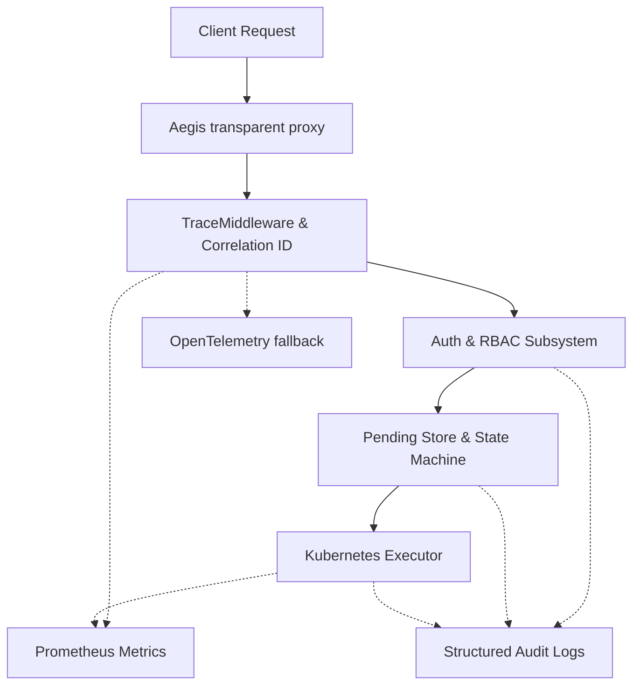

# Aegis Observability Architecture

Aegis implements a comprehensive, multi-layered observability and operational monitoring stack to trace, measure, and audit every incoming request, authentication verification, human approval, and container execution.

## Architectural Layers

### 1. Request Tracing & Correlation IDs
- **TraceMiddleware**: Intercepts every HTTP and JSON-RPC request entering Aegis.
- **Correlation ID Propagation**: Resolves or generates an `X-Correlation-ID` header. This ID is passed to downstream execution environments, logged in all structured stdout messages, and attached to every persistent database audit log entry.
- **OpenTelemetry Fallback**: Integrates with the `opentelemetry` SDK. If enabled, it traces spans for request routes and database queries. If OTel dependencies are absent, it falls back to a safe, no-op implementation.

### 2. Prometheus Metrics
- Exposes standard Prometheus metrics under the `/metrics` path.
- Tracks count, gauge, and histogram statistics for:
  - Intercepted and classification requests (`proxy_requests_total`, `proxy_requests_blocked`, etc.)
  - Approvals status (`approvals_pending`, `approvals_completed`, `approvals_expired`)
  - Execution runs and latency bounds (`executions_total`, `execution_duration_seconds`)
  - Auth checks (`authentication_success`, `authentication_failure`, `permission_denied`)
  - SQLAlchemy Connection Pool and Transactions (`db_queries_total`, `db_transaction_duration`, `db_pool_connections`)

### 3. Structured Audit Events
- Intercepts and records critical security-sensitive operations inside an immutable database audit log.
- Sanitizes payload structures dynamically (e.g. scrubbing credentials, API keys, tokens, signatures).

### 4. Background Scheduled Database Cleanup
- Periodically executes background tasks via a custom scheduler.
- Purges expired pending requests, nonces, and archives completed/failed states.
- Retains audit events according to a configurable `audit_retention_days` setting.
