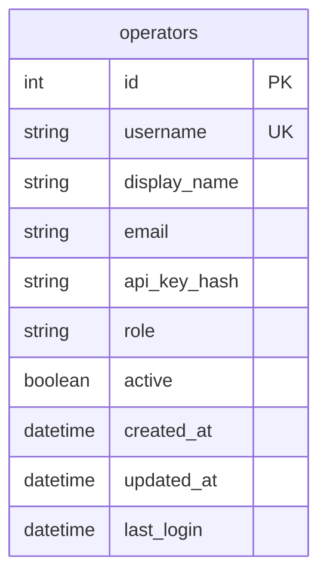

# Operator Data Model

The `OperatorModel` represents human operators in the Veto Ops system. It manages operator metadata, authorization credentials, and logs activity patterns.

## Schema Definition

The operator entity is stored in the `operators` table.



### Columns and Constraints

- **`id`**: Primary key integer, automatically generated.
- **`username`**: Unique string, indexing column. Used for O(1) authentication lookups.
- **`display_name`**: String, friendly operator name.
- **`email`**: String, contact email.
- **`api_key_hash`**: String containing the Argon2 secure hash. Never exposed in API responses or logs.
- **`role`**: String representing the operator's role (`viewer`, `approver`, or `administrator`).
- **`active`**: Boolean flag. When set to `false`, the operator cannot authenticate, resulting in a `403 Forbidden` response.
- **`created_at` / `updated_at`**: Datetime fields tracking database record lifecycle.
- **`last_login`**: Datetime tracking the last successful api key authentication timestamp.

## SQL Representation (SQLAlchemy 2.x)

```python
class OperatorModel(Base):
    __tablename__ = "operators"

    id: Mapped[int] = mapped_column(Integer, primary_key=True)
    username: Mapped[str] = mapped_column(String, unique=True, index=True, nullable=False)
    display_name: Mapped[str] = mapped_column(String, nullable=False)
    email: Mapped[str] = mapped_column(String, nullable=False)
    api_key_hash: Mapped[str] = mapped_column(String, nullable=False)
    role: Mapped[str] = mapped_column(String, nullable=False)
    active: Mapped[bool] = mapped_column(Boolean, default=True, nullable=False)
    created_at: Mapped[datetime] = mapped_column(DateTime, default=datetime.utcnow, nullable=False)
    updated_at: Mapped[datetime] = mapped_column(DateTime, default=datetime.utcnow, onupdate=datetime.utcnow, nullable=False)
    last_login: Mapped[datetime | None] = mapped_column(DateTime, nullable=True)
```

## Audit Log Integration

Every execution run and approval action in Veto Ops is linked back to an operator via the `operator_id` foreign key.
- **Cascades**: When an operator is deleted, `operator_id` fields on associated `approval_records` and `audit_events` are set to `NULL` (`ondelete="SET NULL"`). This preserves the integrity of the audit history while allowing user records to be safely pruned.
